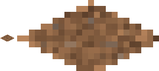
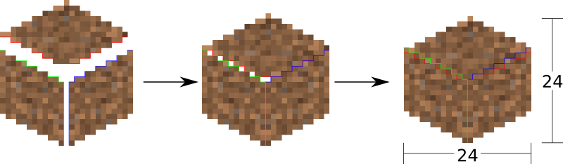
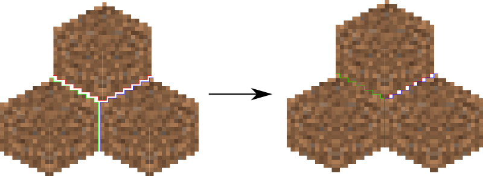

====================
Design Documentation
====================
So you'd like a technical overview of how The Overviewer works, huh? You've come
to the right place!

This document's scope does not cover the details of the code. The code is fairly
well commented and not difficult to understand. Instead, this document is
intended to give an explanation to how the Overviewer was designed and how all
the pieces fit together. Think of this document as commenting on how all the
high level pieces of the code work.

This document is probably a good read to anyone that wants to get involved in
Overviewer development.

So let's get started!

Background Info
===============
The Overviewer's task is to take Minecraft worlds and render them into a set of tiles that can be displayed with a Google Maps interface.

A Minecraft world extends indefinitely along the two horizontal axes, and are
exactly 128 units high. Minecraft worlds are made of cubes, where each slot in
the world's grid has a type that determines what it is (grass, stone, ...).
This makes worlds relatively uncomplicated to render, the Overviewer simply
determines what cubes to draw and where. Since everything in Minecraft is
aligned to a strict grid, placement and rendering decisions are completely
deterministic and can be performed in an iterative fashon.

The coordinate system for Minecraft has three axes. The X and Z axes are the
horizontal axes. They extend indefinitely towards both positive and negative
infinity. (There are practical limits, but no theoretical limits). The Y axis
extends from 0 to 127, which corresponds with the world height limit. Each
block in Minecraft has a coordinate address, e.g. the block at 15,78,-35 refers
to 15 along the X axis, -35 along the Z axis, and 78 units up from bedrock.

The world is divided up into *chunks*. A chunk is a 16 by 16 area of the world
that extends from bedrock to sky. In other words, a 16,128,16 "chunk" of the
world. Chunks also have an address, but in only 2 dimensions. To find the which
chunk a block is in, simply divide its X and Z coordinates by 16 and take the
floor.

Minecraft worlds are generated on-the-fly by the chunk. This means not all
chunks will exist. There is no pattern to chunk generation, the game simply
generates them as needed.

Chunks are stored on-disk in region files. A Minecraft region is a "region" of
32 by 32 chunks. Regions have their own address, and for a particular chunk one
can find its region by dividing its coordinates by 32 and taking the floor. A
region may contain all 1024 of its chunks, or only a subset of them, since not
all chunks may exist. The absence of a region file indicates none of its chunks
exist.

About the Rendering
===================

Minecraft worlds are rendered in an approximated Isometric projection
[#isomorphicref]_, or
what I call the "Sim City projection" [#isomorphicnote]_. In the original design, the projection
acts as if your eye is infinitely far away looking down at the world at a 45
degree angle in the South-East direction (now, the world can be rendered at any
of the 4 oblique directions).

.. [#isomorphicref] http://en.wikipedia.org/wiki/Isometric_projection
.. [#isomorphicnote] To be honest, I'm not entirely sure it's technically an isomorphic projection. There are a lot of very similar projections.

In order to render a Minecraft world, there are a few steps that need to happen.
These steps are explained in detail in the next few sections.

1. Render each block
2. Render the chunks from the blocks
3. Render the tiles of the map from the chunks
4. Shrink and combine the tiles for the other zoom levels

Block Rendering
===============
.. This section shows how each block is pre-rendered

The first step is rendering the blocks from the textures. Each block is built
and cached in global variables of the :mod:`textures` module.

Textures come in the size 16 by 16 [#f1]_. In order to render a cube out of
this, I apply an `affine transformation`_ to the texture in order to skew it to
the right shape.

.. image:: texturecubing.png
    :alt: A texture gets rendered into a cube

.. [#f1]
    Textures can come in other sizes and are re-sized so this section applies
    just the same.

.. _affine transformation: http://en.wikipedia.org/wiki/Affine_transformation

The result is an image of a cube that is 24 by 24 pixels large. This particular
size for the cubes was chosen for an important reason: 24 is divisible by 2 and
by 4. This makes placement much easier. E.g. in order to draw two cubes that are
next to each other in the world, one are drawn exactly 12 pixels over and 6
pixels down from the other. These kind of placement decisions all happen on
exact pixel boundaries.

The transformation happens in two stages. First, the texture is transformed for
the top of the cube. Then the texture is transformed for the left side of the
cube, which is mirrored for the right side of the cube.

Top Transformation
------------------
The transformation from the top is a simple `affine transformation`_. It is
actually several affine transformations: a re-size, a rotation, and a scaling;
but since multiple affine transformations can be chained together simply by
multiplying the transformation matrices together, only one transformation is
actually done.

This can be seen in the function :func:`textures.transform_image`. It takes
these steps:

1. The texture is re-sized to 17 by 17 pixels. This is done because the diagonal
   of a square with sides 17 is approximately 24, which is the target size for
   the bounding box of the cube image. So when it's rotated, it will be the
   correct width.

2. The image is rotated 45 degrees about its center.

3. The image is scaled on the vertical axis by a factor of 1/2.

This produces an image of size 24 by 12 as seen in the following sequence.

.. image:: texturetopsteps.png
    :alt: The 4 steps for transforming a texture square into the top of the cube.

The final image, shown below, becomes the top of the cube.

On the left is the top of the dirt block at actual size after the
transformation, the right is the same but blown up by a factor of 10 with no
interpolation to show the pixels.

Side Transformation
-------------------
The texture square is transformed for the sides of the cube in
:func:`textures.transform_image_side`. This is another `affine transformation`_,
but this time only two transformations are done: a re-size and a shear.

1. First the texture is re-sized to 12 by 12 pixels. This is half the width of
   24 so it will have the correct width after the shear.

2. The 12 by 12 square is sheared by a factor of 1.5 in the Y direction,
   producing an image that is bounded by a 12 by 18 pixel square.

.. image:: texturesidesteps.png
    :alt: Texture being sheared for the side of the cube.

This image is simply flipped along the horizontal axis for the other visible
side of the cube.

.. image:: dirt_side.png
    :alt: The sides of the dirt block

Again, the left are the two sides of the dirt block at actual size, the right is
scaled with no interpolation by a factor of 10 to show the pixels.

An Entire Cube
--------------
These three images, the top and two sides, are pasted into a single 24 by 24
pixel image to get the cube, as shown.

However, notice from the middle of the three images in the sequence below that
the images as transformed don't fit together exactly. There is some overlap when
put in the 24 by 24 box in which they must fit.

There is one more complication. The cubes don't tessellate perfectly. This
diagram illustrates when a cube is positioned next to another. The lower cubes
are 18 pixels lower and 12 pixels to either side, which is half the width and
3/4 the height respectively.

The solution is to manually touch up those 6 pixels. 3 pixels are added on the
upper left of each cube, 3 on the lower right. Therefore, they all line up
perfectly!

This is done at the end of :func:`textures._build_block`

.. image:: pixelfix.png
    :alt: The 6 pixels manually added to each cube.

Chunk Rendering
===============
.. This goes over the rendering of a chunk

Tile Rendering
==============
.. Covers the placement of chunk images on a tile

Reading the Data Files
======================
..
    Covers how to extract the blocks of each chunk from the region files. Also
    covers the nbt file stuff.

Image Composition
=================
..
    Covers the issues I had with PIL's image composition and why we needed
    something fancier.

Multiprocessing
===============
..
    Covers how the Overviewer utilizes multiple processors to render faster

Caching
=======
.. How the overviewer determines what needs to be rendered and what doesn't

Lighting
========

Cave Mode
=========
