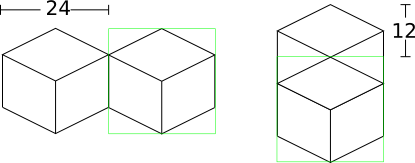
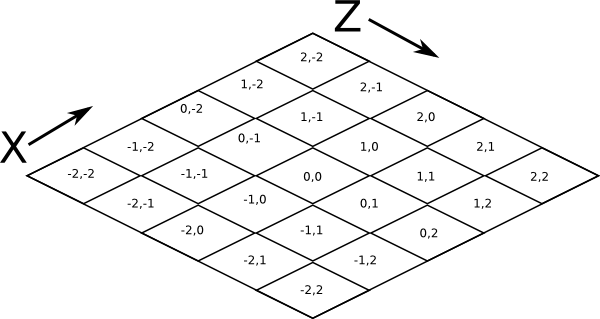
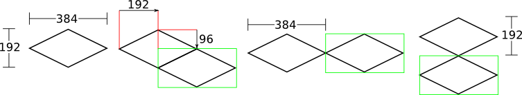

====================
Design Documentation
====================
So you'd like a technical overview of how The Overviewer works, huh? You've come
to the right place!

This document's scope does not cover the details of the code. The code is fairly
well commented and not difficult to understand. Instead, this document is
intended to give an explanation to how the Overviewer was designed, why certain
decisions were made, and how all the pieces fit together. Think of this document
as commenting on how all the high level pieces of the code work.

This document is probably a good read to anyone that wants to get involved in
Overviewer development.

So let's get started!

.. note::

    This page is still under construction

.. contents::

Background Info
===============
The Overviewer's task is to take Minecraft worlds and render them into a set of tiles that can be displayed with a Google Maps interface.

A Minecraft world extends indefinitely along the two horizontal axes, and are
exactly 128 units high. Minecraft worlds are made of cubes, where each slot in
the world's grid has a type that determines what it is (grass, stone, ...).
This makes worlds relatively uncomplicated to render, the Overviewer simply
determines what cubes to draw and where. Since everything in Minecraft is
aligned to a strict grid, placement and rendering decisions are completely
deterministic and can be performed in an iterative fashon.

The coordinate system for Minecraft has three axes. The X and Z axes are the
horizontal axes. They extend indefinitely towards both positive and negative
infinity. (There are practical limits, but no theoretical limits). The Y axis
extends from 0 to 127, which corresponds with the world height limit. Each
block in Minecraft has a coordinate address, e.g. the block at 15,78,-35 refers
to 15 along the X axis, -35 along the Z axis, and 78 units up from bedrock.

The world is divided up into *chunks*. A chunk is a 16 by 16 area of the world
that extends from bedrock to sky. In other words, a 16,128,16 "chunk" of the
world. Chunks also have an address, but in only 2 dimensions. To find the which
chunk a block is in, simply divide its X and Z coordinates by 16 and take the
floor.

Minecraft worlds are generated on-the-fly by the chunk. This means not all
chunks will exist. There is no pattern to which chunks are generated, the game
generates them as needed as players explore the area.

Chunks are stored on-disk in region files. A Minecraft region is a "region" of
32 by 32 chunks. Regions have their own address, and for a particular chunk one
can find its region by dividing its coordinates by 32 and taking the floor. A
region may contain all 1024 of its chunks, or only a subset of them, since not
all chunks may exist. The absence of a region file indicates none of its chunks
exist.

About the Rendering
===================

Minecraft worlds are rendered in an approximated Isometric projection at an
oblique angle. In the original design, the projection acts as if your eye is
infinitely far away looking down at the world at a 45 degree angle in the
South-East direction (now, the world can be rendered at any of the 4 oblique
directions).

In order to render a Minecraft world, there are a few steps that need to happen.
These steps are explained in detail in the next few sections.

1. Render each block
2. Render the chunks from the blocks
3. Render the tiles of the map from the chunks
4. Shrink and combine the tiles for the other zoom levels

Block Rendering
===============
.. This section shows how each block is pre-rendered

The first step is rendering the blocks from the textures. Each block is "built"
from its textures into an image of a cube and cached in global variables of the
:mod:`textures` module.

Textures come in the size 16 by 16 (higher resolution textures are resized and
the process remains the same). In order to render a cube out of this, an `affine
transformation`_ is applied to the texture in order to transform it to the top,
left, and right faces of the cube.

.. _affine transformation: http://en.wikipedia.org/wiki/Affine_transformation

The result is an image of a cube that is 24 by 24 pixels in size. This
particular size for the cubes was chosen for an important reason: 24 is
divisible by 2 and by 4. This makes placement much easier. E.g. in order to draw
two cubes that are next to each other in the world, one is drawn exactly 12
pixels over and 6 pixels down from the other. All placements of the cubes happen
on exact pixel boundaries and no further resolution is lost beyond the initial
transformations.

The transformation happens in two stages. First, the texture is transformed for
the top of the cube. Then the texture is transformed for the left side of the
cube, which is mirrored for the right side of the cube.

Top Transformation
------------------

The transformation for the top face of the cube is a simple `affine
transformation`_ from the original square texture. It is actually several affine
transformations: a re-size, a rotation, and a scaling; but since multiple affine
transformations can be chained together simply by multiplying the transformation
matrices together, only one transformation is actually done.

This can be seen in the function :func:`textures.transform_image`. It takes
these steps:

1. The texture is re-sized to 17 by 17 pixels. This is done because the diagonal
   of a square with sides 17 is approximately 24, which is the target size for
   the bounding box of the cube image. So when it's rotated, it will be the
   correct width.

2. The image is rotated 45 degrees about its center.

3. The image is scaled on the vertical axis by a factor of 1/2.

This produces an image of size 24 by 12 as seen in the following sequence.

The final image, shown below, becomes the top of the cube.

On the left is what will become the top of the block at actual size after the
transformation, the right is the same but blown up by a factor of 10 with no
interpolation to show the pixels.

Side Transformation
-------------------

The texture square is transformed for the sides of the cube in the
:func:`textures.transform_image_side` function. This is another `affine
transformation`_, but this time only two transformations are done: a re-size and
a shear.

1. First the texture is re-sized to 12 by 12 pixels. This is half the width of
   24 so it will have the correct width after the shear.

2. The 12 by 12 square is sheared by a factor of 1.5 in the Y direction,
   producing an image that is bounded by a 12 by 18 pixel square.

.. image:: blockrendering/texturesidesteps.png
    :alt: Texture being sheared for the side of the cube.

This image is simply flipped along the horizontal axis for the other visible
side of the cube.

.. image:: blockrendering/cube_sides.png
    :alt: The sides of the block

Again, shown on the left are the two sides of the block at actual size, the
right is scaled with no interpolation by a factor of 10 to show the pixels.

An Entire Cube
--------------
These three images, the top and two sides, are pasted into a single 24 by 24
pixel image to get the cube, as shown.

However, notice from the middle of the three images in the sequence below that
the images as transformed don't fit together exactly. There is some overlap when
put in the 24 by 24 box in which they must fit.

There is one more complication. The cubes don't tessellate perfectly. This
diagram illustrates when a cube is positioned next to another. The lower cubes
are 18 pixels lower and 12 pixels to either side, which is half the width and
3/4 the height respectively.

.. image:: blockrendering/tessellation.png
    :alt: Cubes don't tessellate perfectly

The solution is to manually touch up those 6 pixels. 3 pixels are added on the
upper left of each cube, 3 on the lower right. Therefore, they all line up
perfectly!

This is done at the end of :func:`textures._build_block`

.. image:: blockrendering/pixelfix.png
    :alt: The 6 pixels manually added to each cube.

Other Cube Types
----------------
Many block types are not rendered as cubes. Fences, rails, doors, torches, and
many other types of blocks have custom rendering routines.

Chunk Rendering
===============

So now that each type of cube is rendered and cached in global variables within
the :mod:`textures` module, the next step is to use the data from a chunk of
the world to arrange these cubes on an image, rendering an entire chunk.

How big is a chunk going to be? A chunk is 16 by 16 blocks across, 128 blocks
high. The diagonal of a 16 by 16 grid is 16 squares. Observe.

This is the top-down view of a single chunk. It is essentially a 16 by 16 grid,
extending 128 units into the page.

.. image:: cuberenderimgs/chunk_topdown.png
    :alt: A 16x16 square grid

Rendered at the appropriate perspective, we'll have something like this
(continued down for 128 layers).

.. image:: cuberenderimgs/chunk_perspective.png
    :alt: Perspective rendering of the two top layers of a chunk.

Each of those cubes shown is where one of the pre-rendered cubes gets pasted.
This happens from back to front, bottom to top, so that the chunk gets drawn
correctly. Obviously if a cube in the back is pasted on the image after the
cubes in the front, it will be drawn on top of everything.

Cube Positioning
----------------
A single cube is drawn in a 24 by 24 square. Before we can construct a chunk out
of individual cubes, we must figure out how to position neighboring cubes.

First, to review, these are the measurements of a cube:

.. image:: cubepositionimgs/cube_measurements.png
    :alt: The measurements of a cube

* The cube is bounded by a 24 by 24 pixel square.

* The side vertical edges are 12 pixels high.

* The top (and bottom) face of the cube takes 12 vertical pixels (and 24
  horizontal pixels).

* The edges of the top and bottom of the cube take up 6 vertical pixels and 12
  horizontal pixels each.

Two cubes that are neighbors after projection to the image (diagonally
neighboring in the world) have a horizontal offset of 24 pixels from each other,
as shown below on the left.  This is mostly trivial, since the images don't end
up overlapping at all. Two cubes in the same configuration but rotated 90
degrees have some overlap in the image, and are only vertically offset by 12
pixels, as shown on the right.

Now for something slightly less trivial: two cubes that are stacked on top of
each other in the world. One is rendered lower on the vertical axis of the
image, but by how much?

Interestingly enough, due to the projection, this is exactly the same offset as
the situation above for diagonally neighboring cubes. The cube outlined in green
is drawn 12 pixels below the other one. Only the order that the cubes are drawn
is different.

And finally, what about cubes that are next to each other in the world ---
diagonally next to each other in the image?

.. image:: cubepositionimgs/cube_neighbors.png
    :alt: Cubes that are neighbors are offset by 12 on the X and 6 on the Y

The cube outlined in green is offset on the horizontal axis by half the cube
width, or 12 pixels. It is offset on the vertical axis by half the height of the
cube's top, or 6 pixels. For the other 3 directions this could go, the
directions of the offsets are changed, but the amounts are the same.

The size of a chunk
-------------------
Now that we know how to place cubes relative to each other, we can begin to
construct a chunk.

Since the cube images are 24 by 24 pixels, and the diagonal of the 16 by 16 grid
is 16 squares, the width of one rendered chunk will be 384 pixels. Just
considering the top layer of the chunk:

.. image:: cuberenderimgs/chunk_width.png
    :alt: Illustrating the width of a single chunk

Since cubes next to each other in the same "diagonal row" are offset by 24
pixels, this is trivially calculated.

The height is a bit more tricky to calculate. Let's start by calculating the
height of a single stack of 128 cubes.

If the top of a stack of cubes is at Y value 0, the 128th cube down must be
drawn (128-1)*12=1524 pixels below. However, that's not the end of the story.
The bottom cube has a height of 24 pixels, so the height of a rendered stack of
128 cube is 1548 pixels.

.. image:: cuberenderimgs/cube_stack128.png
    :alt: A stack of 128 cubes takes 1560 vertical pixels to draw.

You can also calculate this by looking at the sides of the cubes, which don't
overlap at all. They are 12 pixels each, times 128 cubes in the stack, gives
1536 pixels. Add in the 6 pixels for the top cube and the 6 pixels for the
bottom cube to get the total height of 1548 pixels.

So what about the entire chunk? Let's take a look at the top and bottom few
layers of a chunk.

.. image:: cuberenderimgs/chunk_height.png
    :alt: The highest and lowest positioned cubes in a chunk

Let's let the red cubes represent the stack from above. The one on the top we'll
define as position 0, with our vertical axis running positively downward (as is
the case in a lot of imaging library coordinate systems) Therefore, the bottom
red cube is at vertical offset 1524 below.

The green cube at the bottom most tip is the cube with the lowest vertical
placement on the image, so its offset plus 24 pixels for its height will be the
chunk height. Since the green cubes each have an offset of 12 pixels, add 15*12
pixels to get the offset of the lowest green cube: 1704.

So the total size of a chunk in pixels is 384 wide by 1728 tall. That's pretty
tall!

Assembling a Chunk
------------------
Now that we know how to place blocks, assembling the chunk is a relatively
simple process. Frist, create an image 384 by 1728 pixels. Then, paste the
blocks in order from back to front, bottom to top. This ensures that block
visually closer to the viewer are drawn on top, while blocks that should be
obstructed are drawn first and get hidden.

From the data file on disk, block information in a chunk is a three-dimensional
array of bytes, each representing a `block id
<http://www.minecraftwiki.net/wiki/Data_values#Block_IDs_.28Minecraft_Beta.29>`_.
The process of assembling a chunk is essentially reading these values, looking
up the appropriate pre-rendered image representing that block type, and pasting
it on the chunk image at the appropriate location.

First, a bit about how blocks are addressed in a chunk. Consider this diagram of
the *bottom* layer of a chunk: Y=0.

.. image:: cubepositionimgs/chunk_coords.png
    :alt: Illustrating how cubes are addressed in a chunk

The 16x128x16 array of block is iterated over. The inner loop iterates over the
Y axis from bottom to top, the middle loop iterates over the Z axis from 0 to
15, and the outer loop iterates over the X axis from 15 down to 0.

.. note::

    The iteration happens in ``iterate.c`` in the :c:func:`chunk_render`
    function. In the code, the Y and Z axes are switched in name only. (oops)

In other words, the column of blocks at X=15, Z=0 is drawn from bottom to top.
Then the next column over on the Z axis (X=15, Z=1) is drawn, and so fourth
until the entire plane of cubes at X=15 is drawn (the upper-right face). Then it
starts with the next plane at X=14, and so fourth until the entire chunk is
drawn.

Tile Rendering
==============
.. Covers the placement of chunk images on a tile

So now that we know how to draw a single chunk, we can move on to placing them
on an image.

For the diagrams in this section, we are positioning an entire chunk, but
frequently, only the top face of the chunk is drawn (shown in green below).

.. image:: tilerendering/topofchunk.png
    :alt: The top of a chunk is highlighted

This makes it easier and less cumbersome to describe chunk positionings. Just
remember that chunks extend down for 1536 more pixels.

Chunk Addressing
----------------

Chunks in Minecraft have an X,Z address, starting at 0,0 and extending to
positive and negative infinity on both axes. Since we're looking at things
diagonally, however, we need a way of addressing these chunks in the final
image. For that, we refer to them in rows and columns. Consider this grid
showing the tops of a five by five region of chunks, labeled with their in-game
addresses.

Now, we want to transform each chunk to a row/column address as shown here:

.. image:: tilerendering/chunkgridwithrowcol.png
    :alt: A grid of 5x5 chunks showing how chunks are addressed.

So the chunk at address 0,0 would be at col 0, row 0; while the chunk at address
1,1 would be at col 2, row 0. The intersection of the red and green lines
addresses the chunk in col,row format.

Notice that as a consequence of this addressing scheme, there is no chunk at
e.g. column 1 row 0. There are some col,row addresses that lie between chunks
(as can be seen where the red/green lines intersect at a chunk boundary instead
of the middle of a chunk). Something to keep in mind.

So how does one translate between them? It turns out that a chunk's column
address is simply the sum of the X and the Z coordinate, while the row is the
difference. Try it!

::

    col = X + Z
    row = Z - X

    X = (col - row) / 2
    Z = (col + row) / 2

Chunk Positioning
-----------------
Again just looking at the top of a chunk, we can work out how to position them
relative to each other. This is similar to how to position blocks relative to
each other, but this time, for chunks.

A chunk's top face is 384 pixels wide by 192 pixels tall. Similar to the block,
neighboring chunks have these relationships:

But that's all pretty trivial. With this knowledge, we could draw the chunks at
the above offsets in one large image, but for large worlds, that would quickly
become too much to handle. (Early versions of the Overviewer did this, but the
large, unwieldy images quickly motivated the development of rendering to
individual tiles)

Tile Layout
-----------

Instead of rendering to one large image, chunks are rendered to small tiles.
Only a handful of chunks need to be rendered into each tile. The downside is
that chunks must be rendered multiple times for each tile they appear in, but
the upside is that arbitrarily sized maps can be viewed.

The Overviewer uses a tile size of 384 by 384 pixels. This is the same as a
width of a chunk and is no coincidence. Just considering the top face of a
chunk, 8 chunks get rendered into a tile in this configuration:

.. image:: tilerendering/chunksintile.png
    :alt: The 8 chunks that get rendered into a tile

So the overall strategy is to convert all chunks into diagonal col,row
coordinates, then for each tile decide which chunks belong in it, then render
them in the appropriate place on the tile.

The rendering routines are actually passed a range of chunks to render, e.g.
rows 4-6, cols 20-24. The lower bound col,row chunk given in the range is
rendered at position 0,0 in the diagram above. That is, at offset -192,-96
pixels.

The rendering routines takes the given range of columns and rows, converts it
back into chunk coordinates, and renders the given 8 chunks plus all chunks from
the 16 rows above the given range (see the note below). The chunks are
positioned correctly with the above positioning rules, so any chunks that are
out of the bounds get rendered off the tile and don't affect the final image.
(There is therefore no penalty for rendering out-of-bounds chunks for a tile
except increased processing)

.. note::

    Remember that chunks are actually very tall, so there are actually several
    rows above 0 in the above diagram that are rendered into the tile. Since the
    chunk outlines in the diagrams are only the top face of the chunk, they most
    likely don't contribute to the image since chunks usually don't have
    anything to render way up at the top near the sky.

Since every other column of chunks is half-way in two tiles, they must be
rendered twice. Each neighboring tile is therefore only 2 columns over, not 3 as
one may suspect at first. Same goes for the rows: The next tile down is 4 rows
down, not 5.

Quadtrees
=========
.. About the tile output 

get_range_by_path
-----------------
.. Explain the quadtree.QuadtreeGen._get_range_by_path method

Reading the Data Files
======================
..
    Covers how to extract the blocks of each chunk from the region files. Also
    covers the nbt file stuff.

Image Composition
=================
..
    Covers the issues I had with PIL's image composition and why we needed
    something fancier.

Multiprocessing
===============
..
    Covers how the Overviewer utilizes multiple processors to render faster

Caching
=======
.. How the overviewer determines what needs to be rendered and what doesn't

Lighting
========

Cave Mode
=========
