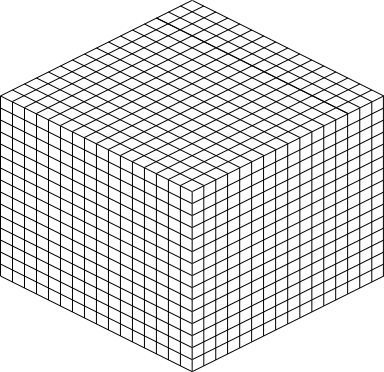
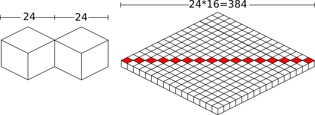
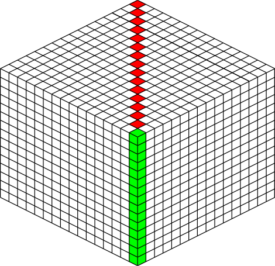
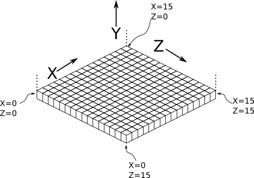
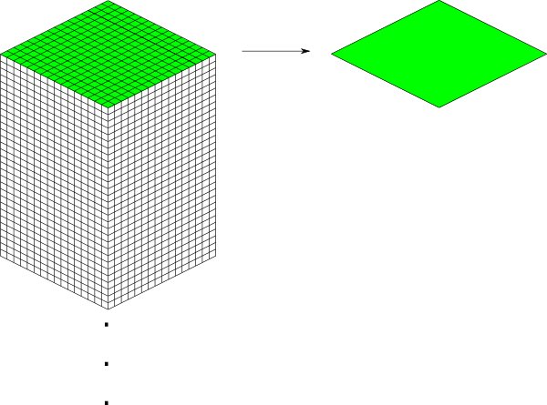
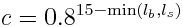

====================
Design Documentation
====================
So you'd like a technical overview of how The Overviewer works, huh? You've come
to the right place!

This document's scope does not cover the details of the code. The code is fairly
well commented and not difficult to understand. Instead, this document is
intended to give an explanation to how the Overviewer was designed, why certain
decisions were made, and how all the pieces fit together. Think of this document
as commenting on how all the high level pieces of the code work.

This document is probably a good read to anyone that wants to get involved in
Overviewer development.

So let's get started!

.. note::

    This page is continually under construction

.. contents::

Background Info
===============

The Overviewer's task is to take Minecraft worlds and render them into a set of
tiles that can be displayed with a Google Maps interface. This section goes over
how Minecraft worlds work and are stored.

A Minecraft world extends indefinitely along the two horizontal axes, and are
exactly 256 units high. Minecraft worlds are made of voxels (volumetric pixels),
hereby called "blocks", where each block in the world's grid has a type that
determines what it is (grass, stone, ...).  This makes worlds relatively
uncomplicated to render, the Overviewer simply determines what blocks to draw
and where. Since everything in Minecraft is aligned to a strict grid, placement
and rendering decisions are completely deterministic and can be performed
iteratively.

The coordinate system for Minecraft has three axes. The X and Z axes are the
horizontal axes. They extend indefinitely towards both positive and negative
infinity. (There are practical limits, but no theoretical limits). The Y axis
extends from 0 to 255, which corresponds with the world height limit. Each
block in Minecraft has a coordinate address, e.g. the block at 15,78,-35 refers
to 15 along the X axis, -35 along the Z axis, and 78 units up from bedrock.

The world is organized in a three-layer hierarchy. At the finest level are the
blocks (voxels). A 16x16x16 array of blocks is called a *chunk section*. A
vertical column of 16 chunk sections makes a *chunk*. A chunk is therefore a 16
by 16 area of the world that extends from bedrock to sky. In other words, a 16
by 256 by 16 "chunk" of the world. A 32 by 32 area of chunks is called a
*region*. Regions are stored on disk one per file.

While blocks have a global coordinate (the ones you see in the debug output
in-game), they also have a local coordinate within a chunk section and within a
chunk. Also, chunks and regions have their own coordinates to identify
themselves. To find which chunk a block is in, simply divide its coordinates by
16 and take the floor. To find which region a chunk is in, divide the chunk
coordinates by 32 and take the floor. To find which chunk section a block is in,
take its Y coordinate and floor-divide by 16.

Minecraft worlds are generated on-the-fly by the chunk. This means not all
chunks will exist, and not all sections within a chunk will exist. There is no
pattern to which chunks are generated, the game generates them as needed as
players explore the area. A region file may not exist if none of its chunks
exist.

Overviewer at a High Level
==========================

Minecraft worlds are rendered in an approximated Isometric projection at an
oblique angle. In the original design, the projection acts as if your eye is
infinitely far away looking down at the world at a 45 degree angle in the
South-East direction (now, the world can be rendered at any of the 4 oblique
directions).

.. image:: screenshot.png
    :alt: A screenshot of Overviewer output

The Overviewer is a sprite-based renderer. Each block type corresponds to a
pre-rendered sprite (a small image). The basic idea is to iterate over the
blocks of the world and draw these sprites to the appropriate location on the
map.

These are the high-level tasks The Overviewer must perform in rendering a map:

1. Render each block sprite from the textures
2. Scan the chunks of the world and determine which tiles need rendering
3. Render a chunk by drawing the appropriate blocks sprites on an image
4. Render a tile of the map from several chunk images
5. Compose the lower-zoom tiles from the higher-zoom tiles

The next sections will go over how these tasks work.

Block Rendering
===============
.. This section shows how each block is pre-rendered

The first step is rendering the block sprites from the textures. Each block is
"built" from its textures into an image of a cube and cached in a
:class:`Textures` object.

Textures come from files inside of a "textures" folder.  If the file is square (has equal width
and height dimensions), it is scaled down to 16 x 16 pixels.  Non-square images are used with animated
textures.  In this case, the first frame of the animated texture is used, and also scaled to a 16 by 16 image.
In order to draw a cube out of the textuers, an `affine transformation`_ is applied to
the images for the top and sides of the cube in order to transform it to the
appropriate perspective.

.. note::

    This section goes over the simple case for a regular cube, which are most of
    the blocks in Minecraft. There are lots of irregular blocks that aren't
    cubes (fences, torches, doors) which require custom rendering. Irregular
    blocks are not covered by this design document. Each type of block has its
    own function in :mod:`overviewer_core.textures` that defines how to render
    it.

.. image:: blockrendering/texturecubing.png
    :alt: A texture gets rendered into a cube

.. _affine transformation: http://en.wikipedia.org/wiki/Affine_transformation

Every block sprite is exactly 24 by 24 pixels in size. This particular size for
the cubes was chosen for an important reason: 24 is divisible by 2 and by 4.
This makes placement much easier. E.g. in order to draw two cubes that are next
to each other in the world, one is drawn exactly 12 pixels over and 6 pixels
down from the other. All placements of the cubes happen on exact pixel
boundaries and no further resolution is lost beyond the initial transformations.
(This advantage will become clear in the :ref:`cubepositioning` section; all
offsets are a nice even 6, 12, or 24 pixels)

A cube sprite is built in two stages. First, the texture is transformed for the
top of the cube. Then the texture is transformed for the left side of the cube,
which is mirrored for the right side of the cube.

Top Transformation
------------------

The transformation for the top face of the cube is a simple `affine
transformation`_ from the original square texture. It is actually several affine
transformations: a re-size, a rotation, and a scaling; but since multiple affine
transformations can be chained together simply by multiplying the transformation
matrices together, only one transformation is actually done.

This can be seen in the function
:func:`overviewer_core.textures.transform_image`. It performs three steps:

1. The texture is re-sized to 17 by 17 pixels. This is done because the diagonal
   of a square with sides 17 is approximately 24, which is the target size for
   the bounding box of the cube image. So when it's rotated, it will be the
   correct width. (Better to scale it now than after we rotate it)

2. The image is rotated 45 degrees about its center.

3. The image is scaled on the vertical axis by a factor of 1/2.

This produces an image of size 24 by 12 as seen in the following sequence.

.. image:: blockrendering/texturetopsteps.png
    :alt: The 4 steps for transforming a texture square into the top of the cube.

The final image, shown below, becomes the top of the cube.

.. image:: blockrendering/cube_top.png
    :alt: Top of the cube

On the left is what will become the top of the block at actual size after the
transformation, the right is the same but blown up by a factor of 10 with no
interpolation to show the pixels.

Side Transformation
-------------------

The texture square is transformed for the sides of the cube in the
:func:`textures.transform_image_side` function. This is another `affine
transformation`_, but this time only two transformations are done: a re-size and
a shear.

1. First the texture is re-sized to 12 by 12 pixels. This is half the width of
   24 so it will have the correct width after the shear.

2. The 12 by 12 square is sheared by a factor of 1.5 in the Y direction,
   producing an image that is bounded by a 12 by 18 pixel square.

This image is simply flipped along the horizontal axis for the other visible
side of the cube.

Again, shown on the left are the two sides of the block at actual size, the
right is scaled with no interpolation by a factor of 10 to show the pixels.

An Entire Cube
--------------
These three images, the top and two sides, are pasted into a single 24 by 24
pixel image to get the cube sprite, as shown.

However, notice from the middle of the three images in the sequence below that
the images as transformed don't fit together exactly. There is some overlap when
put in the 24 by 24 box in which they must fit.

.. image:: blockrendering/cube_parts.png
    :alt: How the cube parts fit together

There is one more complication. The cubes don't tessellate perfectly. A six
pixel gap is left between the lower-right border and upper-left border of blocks
in this arrangement:

The solution is to manually touch up those 6 pixels. 3 pixels are added on the
upper left of each cube, 3 on the lower right. Therefore, they all line up
perfectly!

This is done at the end of :meth:`Textures.build_block`

Chunk Rendering
===============

With these cube sprites, we can draw them together to start constructing the
world. The renderer renders a single chunk section (a 16 by 16 by 16 group of
blocks) at a time.

This section of the design doc goes over how to draw the cube sprites together
to draw an entire chunk section.

How big is a chunk section going to be? A chunk section is a cube of 16x16x16
blocks.

Rendered at the appropriate perspective, we'll have a cube made up of 4096
smaller cubes, like this:

Each of those cubes shown is where one of the pre-rendered block sprites gets
pasted; the entire thing is a chunk section. The renderer iterates over a chunk
layer-at-a-time from bottom to top, drawing the sprites. The order is important
so that the it gets drawn correctly. Obviously if a sprite in the back is pasted
on the image after the sprites in the front are drawn, it will be drawn on top
of everything instead of behind.

.. _cubepositioning:

Block Positioning
-----------------

A single block is a 24 by 24 pixel image. Before we can construct a chunk
section out of individual blocks, we must figure out how to position neighboring
blocks.

First, to review, these are the measurements of a block sprite:

* The image is bounded by a 24 by 24 pixel square.

* The side vertical edges are 12 pixels high.

* The top (and bottom) face of the block takes 12 vertical pixels (and 24
  horizontal pixels).

* The edges of the top and bottom of the block take up 6 vertical pixels and 12
  horizontal pixels each.

Two blocks that are neighbors after projection to the image (diagonally
neighboring in the world) have a horizontal offset of 24 pixels from each other,
as shown below on the left.  This is mostly trivial, since the images don't
overlap at all. Two blocks in the same configuration but rotated 90 degrees have
some overlap as shown on the right, and are only vertically offset by 12 pixels.

.. image:: cubepositionimgs/cube_horizontal_offset.png
    :alt: Two blocks horizontally positioned are offset by 24 pixels on the X axis.

Now for something slightly less intuitive: two blocks that are stacked on top of
each other in the world. One is rendered lower on the vertical axis of the
image, but by how much?

.. image:: cubepositionimgs/cube_stacking.png
    :alt: Two blocks stacked are offset in the image by 12 pixels.

Interestingly enough, due to the projection, this is exactly the same offset as
the situation above for diagonally neighboring blocks. The block outlined in green
is drawn 12 pixels below the other one. Only the order that the blocks are drawn
is different.

And finally, what about blocks that are next to each other in the world ---
diagonally next to each other in the image?

The block outlined in green is offset on the horizontal axis by half the block
width, or 12 pixels. It is offset on the vertical axis by half the height of the
block's top, or 6 pixels. For the other 3 directions this could go, the
directions of the offsets are changed, but the amounts are the same.

The size of a chunk
-------------------
Now that we know how to place blocks relative to each other, we can begin to
construct an entire chunk section.

Since the block sprites are 24 by 24 pixels, and the diagonal of the 16 by 16
grid is 16 squares, the width of one rendered chunk section will be 384 pixels.
Just considering the top layer of blocks within a section:

Since blocks next to each other in the same "diagonal row" are offset by 24
pixels, this is trivially calculated.

The height is a bit more tricky to calculate. Let's start by calculating the
height of a single stack of 16 blocks.

The non-overlapping edge of each block sprite is 12 pixels high. Since there are
16 blocks in this stack, that's 192 pixels high. There are also 6 additional
pixels at the top and bottom of the stack as shown, giving a total height of 204
pixels.

But that's just for one column of blocks. What about the entire chunk section?
Take a look at this diagram:

The green highlighted blocks are the stack we calculated just above and have a
height of 204 pixels. The red highlighted blocks each take 12 pixels of vertical
space on the image, and there are 15 of them. So 204 + 12*15 is 384 pixels.

So the total size of a chunk section in pixels is 384 wide by 384 tall.

Assembling a Chunk
------------------

Now that we know how to place blocks, here's how they are arranged to form an
entire chunk section. The coordinate system is arranged as shown, with the
origin being at the left corner.

To ensure that block closer to the viewer are drawn on top while blocks that
should be obstructed are drawn are hidden, the blocks are drawn one layer at a
time from bottom to top (Y=0 to Y=15) and from back to front.

From the data file on disk, block information in a chunk is a three-dimensional
array of bytes, each representing a `block id
<http://www.minecraftwiki.net/wiki/Data_values#Block_IDs_.28Minecraft_Beta.29>`_.
The process of assembling a chunk is simply a matter of iterating over this
array, reading the blockid values, looking up the appropriate sprite, and
pasting it on the chunk image at the appropriate location.

Chunk Placement
===============
.. Covers the placement of chunk images on a tile

Now that we know how to draw a single chunk, let's move on to how to place
chunks relative to each other.

Before we get started, let's take a moment to remember that one chunk section is
only 1/16th of a chunk:

A chunk is 16 chunk sections stacked together.

Since this is pretty tall, the diagrams in this section are simplified to only
show the *top face* of a chunk, as shown in green here:

This makes it easier and less cumbersome to describe how to place chunks
together on a tile. Just remember that chunks are actually very tall and extend
down far beyond the drawn diamonds in these diagrams.

Chunk Addressing
----------------

Chunks in Minecraft have an X,Z address, with the origin at 0,0 and extending to
positive and negative infinity on both axes (Recall from the introduction that
chunk addresses are simply the block addresses divided by 16). Since we're going
to render at a diagonal perspective, it is convenient to perform a change of
coordinate system. For that, we translate X,Z coordinates into column,row
coordinates. Consider this grid showing 25 chunks around the origin. They are
labeled with their X,Z chunk addresses.

.. image:: tilerendering/chunkgrid.png
    :alt: A grid of 5x5 chunks showing how chunks are addressed.

Now, we want to transform each chunk to a row/column address as shown here:

So the chunk at address 0,0 would be at col 0, row 0; while the chunk at address
1,1 would be at col 2, row 0. The intersection of the red and green lines
addresses the chunk in col,row format.

.. note::

    As a consequence of this addressing scheme, there is no chunk at e.g. column
    1 row 0. There are some col,row addresses that lie between chunks, and
    therefore do not correspond to a chunk. (as can be seen where the red/green
    lines intersect at a chunk boundary instead of the middle of a chunk).

So how does one translate between them? It turns out that a chunk's column
address is simply the sum of the X and the Z coordinate, while the row is the
difference. Try it!

::

    col = X + Z
    row = Z - X

    X = (col - row) / 2
    Z = (col + row) / 2

Chunk Positioning
-----------------

This section will seem very familiar to the block positioning. In fact, it is
exactly the same but with different numbers (because blocks and chunk sections
have the exact same proportions), so let's speed through this.

A chunk's top face is 384 pixels wide by 192 pixels tall. They therefore have
these offsets from their neighbors:

.. image:: tilerendering/chunkpositioning.png
    :alt: Chunk positioning diagram

Tile Rendering
==============

Now that we know how to translate chunk coordinates to col/row coordinates, and
know how to calculate the offset from the origin on the final image, we could
easily draw the chunks in one large image. However, for large worlds, that would
quickly become too much data to handle at once. (Early versions of the
Overviewer did this, but the large, unwieldy images quickly motivated the
development of rendering to individual tiles).

Hence choosing a technology like Google Maps, which draws small tiles together
to make it look like one large image, lets rendering even the largest worlds
possible. The Overviewer can draw each tile separately and not have to load the
entire map into memory at once. The next sections describe how to determine
which chunks to render in which tiles, and how to reason about tile ↔ chunk
mappings.

Tile Layout
-----------

Instead of rendering to one large image, chunks are rendered to small tiles.
Only a handful of chunks need to be rendered into each tile. The downside is
that chunks must be rendered multiple times for each tile they appear in, but
the upside is that arbitrarily sized maps can be viewed.

The Overviewer uses a tile size of 384 by 384 pixels. This is the same as the
size of a chunk section and is no coincidence. Just considering the top face of
a chunk, the 8 chunks directly below itget rendered into a tile in this
configuration:

.. note::

    Don't forget that chunks are tall, so many more than 8 chunks get rendered
    into this tile. If you think about it, chunks from the rows *above* the ones
    in that diagram may have blocks that fall into this tile, since the diamonds
    in the diagram correspond to the *tops* of the chunks, and chunks extend
    *down*.

.. note::

    This is an important diagram and we'll be coming back to it. Make sure it makes
    sense. As a side note, if anything in this document *doesn't* make sense, please
    let us know in IRC or by filing an issue. I want these docs to be as clear as
    possible!

So the overall strategy is to convert all chunks into diagonal col,row
coordinates, then for each tile decide which chunks belong in it, then render
them in the appropriate place on the tile.

The rendering routines are actually passed a range of chunks to render, e.g.
rows 4-6, cols 20-24. The lower bound col,row chunk given in the range is
rendered at position 0,0 in the diagram above. That is, at offset -192,-96
pixels.

The rendering routines takes the given range of columns and rows, converts it
back into chunk coordinates, and renders the given 8 chunks plus all chunks from
the 16 rows above the given range (see the note below). The chunks are
positioned correctly with the above positioning rules, so any chunks that are
out of the bounds get rendered off the tile and don't affect the final image.
(There is therefore no penalty for rendering out-of-bounds chunks for a tile
except increased processing)

Since every other column of chunks is half-way in two tiles, they must be
rendered twice. Each neighboring tile is therefore only 2 columns over, not 3 as
one may suspect at first. Same goes for the rows: The next tile down is 4 rows
down, not 5.

To further illustrate this point, here are four tiles arranged on the grid of
chunks. Notice how the tiles are addressed by the col,row of the chunk in the
upper-left corner. Also notice how neighboring tiles are 2 columns apart but 4
rows apart.

.. image:: tilerendering/tilegrid.png
    :alt: 4 tiles arranged on the grid of chunks

Quadtrees
=========
.. About the tile output 

Tiles are rendered and stored in a quadtree on disk. Each node is a tile of the
world, and each node has four children representing a zoomed-in tile of the four
quadrants.

The tree is generated from the bottom-up. The highest zoom level is rendered
directly from the chunks and the blocks, then four of those rendered tiles are
shrunk and concatenated to get the next zoom level. The tree is built up in this
way until the entire world is compressed down to a single tile.

We've already seen how tiles can be identified by the column,row range of the
chunks that make up the tile. More precisely, since tiles are always the same
size, the chunk that goes in the tile's 0,0 col,row slot identifies the tile.

Now, tiles are also identified by their path in the quadtree. For example,
``3/0/0/1/1/2.png`` refers to the tile starting at the base, under the third
quadrant, then the 0th quadrant, then the 0th, and so fourth.

Quadtree Size
-------------
The size of the quadtree must be known before it's generated, that way the code
knows where to save the images. This is easily calculated from a few
realizations. Each depth in the quadtree doubles the number of tiles in each
dimension, or, quadruples the total tiles. While there is only one tile at level
0, there are four at level 1, 16 at level 2, and 4^n at level n.

To find how deep the quadtree must be, we look at the size of the world. First
find the maximum and minimum row and column of the chunks. Just looking at
columns, let's say the maximum column is 82 and the minimum column is -136. A
zoom level of 6 will be 2^6 tile across and 2^6 tiles high at the highest level.

Since horizontally tiles are two chunks wide, multiply 2^6 by 2 to get the total
diameter of this map in chunks: 2*2^6. Is this wide enough for our map?

It turns out it isn't (2*2^6=128, 136+82=218). A zoom level of 7 is 2^7 tiles
across, or 2*2^7 chunks across. This turns out is wide enough (2*2^7 = 256),
however, Overviewer maps are always centered at point 0,0 in the world. This is
so tiles will always line up no mater how the map may expand in the future.

So zoom level 7 is *not* enough because, while the chunk diameter is wide
enough, it only extends half that far from the origin. The chunk *radius* is 2^7
(half the diameter) and 2^7=128 is not wide enough for the minimum column at
absolute position 136.

So this example requires zoom level 8 (at least in the horizontal direction.
The vertical direction must also be checked).

Quadtree Paths
--------------

To illustrate the relationship between tile col,row addresses and their path,
consider these 16 tiles from a depth 2 quadtree:

The top address in each tile is the col,row address, where the chunk outlined in
green in the center is at 0,0. The lower address in each tile is the path. The
first number indicates which quadrant the tile is in overall, and the second is
which quadrant within the first one.

get_range_by_path
-----------------
.. Explain the quadtree.QuadtreeGen._get_range_by_path method

Reading the Data Files
======================
..
    Covers how to extract the blocks of each chunk from the region files. Also
    covers the nbt file stuff.

Image Composition
=================
..
    Covers the issues I had with PIL's image composition and why we needed
    something fancier.

Multiprocessing
===============
..
    Covers how the Overviewer utilizes multiple processors to render faster

Caching
=======
.. How the overviewer determines what needs to be rendered and what doesn't

Lighting
========

Minecraft stores precomputed lighting information in the chunk files
themselves, so rendering shadows on the map is a simple matter of
interpreting this data, then adding a few extra steps to the render
process. These few extra steps may be found in
``rendermode-lighting.c`` or ``rendermode-smooth-lighting.c``,
depending on the exact method used.

Each chunk contains two lighting arrays, each of which contains one
value between 0 and 15 for each block. These two arrays are the
BlockLight array, containing light received from other blocks, and the
SkyLight array, containing light received from the sky. Storing these
two seperately makes it easier to switch between daytime and
nighttime. To turn these two values into one value between 0 and 1
representing how much light there is in a block, we use the following
equation (where l\ :sub:`b` and l\ :sub:`s` are the block light and
sky light values, respectively):

For night lighting, the sky light values are shifted down by 11 before
this lighting coefficient is calculated.

Each block of light data applies to all the block faces that touch
it. So, each solid block doesn't receive lighting from the block it's
in, but from the three blocks it touches above, to the left, and to
the right. For transparent blocks with potentially strange shapes,
lighting is approximated by using the local block lighting on the
entire image.

For some blocks, notably half-steps and stairs, Minecraft doesn't
generate valid lighting data in the local block like it does for all
other transparent blocks. In these cases, the lighting data is
estimated by averaging data from nearby blocks. This is not an ideal
solution, but it produces acceptable results in almost all cases.

Smooth Lighting
---------------

In the smooth-lighting rendermode, solid blocks are lit per-vertex
instead of per-face. This is done by covering all three faces with a
quadralateral where each corner has a lighting value associated with
it. These lighting values are then smoothly interpolated across the
entire face.

To calculate these values on each corner, we look at lighting data in
the 8 blocks surrounding the corner, and ignore the 4 blocks behind
the face the corner belongs to. We then calculate the lighting
coefficient for all 4 remaining blocks as normal, and average them to
obtain the coefficient for the corner. This is repeated for all 4
corners on a given face, and for all visible faces.

The `ambient occlusion`_ effect so strongly associated with smooth
lighting in-game is a side effect of this method. Since solid blocks
have both light values set to 0, the lighting coefficient is very
close to 0. For verticies in corners, at least 1 (or more) of the 4
averaged lighting values is therefore 0, dragging the average down,
and creating the "dark corners" effect.

.. _ambient occlusion: http://en.wikipedia.org/wiki/Ambient_occlusion

Cave Mode
=========
