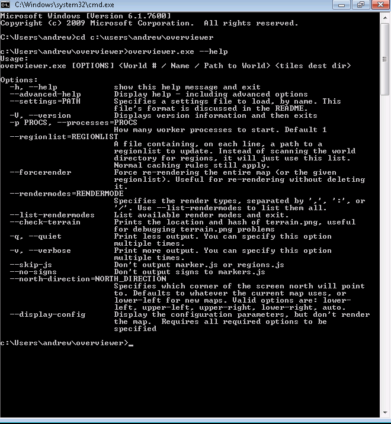

====================
Windows Newbie Guide
====================
If you're running Windows and aren't as familiar with the Windows command
prompt as the rest of the documentation assumes you are, this page is for you!

The Overviewer is a *command line* tool, which means you will need to use the command line to run it.

**First step:** Open the command line.
    Open your Start menu and type in the box 'cmd' and press enter. If you're
    running XP you'll go to the "run" option instead and then type 'cmd' and
    press enter.

    .. image:: opening_cmd.png
    
    This should bring up the *command prompt*, a black window with a prompt
    where you can type *commands*. The prompt part will probably look something
    like ``C:\Users\andrew>`` followed by a cursor where you type your commands.

    .. image:: cmd.png

    Leave this window open and move on to step 2.

Now that you know how to open a command line, and haven't been scared off yet,
the next step is to download the latest Overviewer.

**Step 2:** Download Overviewer
    Go to the `Downloads Page <https://overviewer.org/downloads>`_ and
    download the *latest* version for your architecture, either 32 bit
    or 64 bit.
    
    *This is important. If you don't know which to choose, 32 or 64,* then you
    can find out by clicking on the start menu, *right clicking* on the
    "Computer" icon or "My Computer" icon (depending on your version of
    Windows), and then selecting "Properties." Somewhere among the information
    about your computer it should tell you if you're running a *32 bit operating
    system* or *64 bit operating system*.

    .. image:: computer_properties.png
    
    .. image:: system.png

    Once you know if your computer is 32 or 64 bit, go and download the latest
    version. We make small changes all the time, and a new version is uploaded
    to that page for every change we make. It's usually best to just get the
    latest.

Okay, you've got a command prompt open. You've got The Overviewer downloaded.
We're half way there!

**Step 3:** Extract the Overviewer zip you downloaded.
    This is easy. I assume you know how to unzip things. Unzip the contents to
    somewhere you can find easily. You'll need to find it in the command
    prompt. It may help to leave the window with the unzipped contents open so
    you can remind yourself where it is.

    *Keep all those files together!* They're all needed to run The Overviewer.

    .. image:: extracting.png

**Step 4:** Change directory in command prompt to the location of overviewer.exe
    You remember the location of the files you just extracted? Windows doesn't
    always make it easy. Here's how in windows 7: just click on the little icon
    to the left of the directory name.

    .. image:: location1.png

    .. image:: location2.png
    
    Got the location? Good. We're going to *change directory* to that directory
    with the command prompt. Bring the command prompot window back up. The
    command we're going to use is called ``cd``, it stands for ... *change
    directory*!

    I'm going to illustrate this with an example. Let's say you extracted
    Overviewer to the directory
    ``c:\users\andrew\overviewer``. Here is exactly
    what you'll type into the command prompt and then press enter::

        cd c:\users\andrew\overviewer

    .. image:: changed_dir.png

    Okay, did it work? Your command *prompt* should now have the *current
    working directory* in it. If your prompt changed to the directory that you
    just cd'd to, then your current directory changed successfully! You're ready
    for the next step!

Okay before we actually run Overviewer for real, let's do a checkpoint. You
should have *cd*'d to the directory where overviewer.exe is. To test, type this
in and you should see the help text print out::

    overviewer.exe --help

note the two hyphens before "help". You should see something like this:

The help text displays the *usage* of overviewer.exe, or the parameters it takes
to run it. It's kind of long, I had to make my window larger to show it all.

::

    Usage:
    overviewer.exe [--rendermodes=...] [options] <World> <Output Dir>

Command line tool usage convention says that items in [square brackets] are
*optional*, while items in <angled brackets> are *required*.

**Step 5** Render a map!
    Okay, so to render a map, you have to run ``overviewer.exe`` with two
    *parameters*: the *world path* and a *destination directory*.

    Let's say you have a world named "Singleplayer world" and you want to put
    the tiles into a directory on your desktop. Singleplayer worlds are stored
    on your hard drive at a location called ``%appdata%\.minecraft\saves``. Try
    typing this into the command prompt::

        overviewer.exe "%appdata%\.minecraft\saves\Singleplayer World" c:\users\andrew\desktop\mymap

    .. note::
        You must use quotation marks around a path that has spaces in it.

    .. note::
        ``%appdata%`` is a special windows "variable" that refers to the
        location on your drive where applications can store their data. Typing
        ``%appdata%`` instead of the full path is a convenient shortcut.

    If everything went according to plan, The Overviewer should now be churning
    away furiously on your world, rendering thousands of image files that
    compose a map of your world.

    When it's done, open up the file ``index.html`` in a web browser and you
    should see your map!

I hope this has been enough to get some of you Windows noobs started on The
Overviewer. Sorry there's no easy-to-use graphical interface right now. We want
to make one, we really do, but we haven't had the time and the talent to do so
yet.

The preferred way to run The Overviewer is with a *configuration file*. Without
one, you can only do the most basic of renders. Once you're ready, head to the
:doc:`../config` page to see what else The Overviewer can do. And as always,
feel free to drop by in `IRC <https://overviewer.org/irc/>`_ if you have any
questions! We're glad to help!

Common Pitfalls
---------------

     - Wrong working directory::

            "overviewer.exe" is not recognised as an internal or external
            command, operable program, or batch file.

       This is a common mistake to make, especially for people unfamiliar
       with the command line. This happens if your current working directory
       does not contain overviewer.exe. This is likely because you've forgot
       to change the working directory to the directory you have unzipped
       overviewer into. Re-read Step 4 for instructions on how to do that.

     - Overviewer is on a different drive than C:\

       You may have Overviewer located on a different partition than C:,
       and for some odd reason the windows command line does not accept
       "cd D:\" as a way to switch partitions. To do this, you have to just
       type the drive letter followed by a colon::

            D:

       This should switch your current working directory to D:\

Using GitHub Gist
-----------------

Sometimes, when helping people with issues with Overviewer, we'll often
ask to see the config file you're using, or, if there was an Overviewer
error, a full copy of an error message.   Unfortunately, `IRC <https://overviewer.org/irc/>`_
is not a good way to send large amounts of text.  So we often ask users
to create a `Gist <https://gist.github.com/>`_ containing the text we want
to see.  Sites like these are also called Pastebins, and you are welcome
to use your favorite pastebin site, if you'd like.

* First, go to http://gist.github.com/

* Second, paste your text into the primary text entry area:

    .. image:: gist1.png

* Third, click the 'Create Secret Gist' button.  A secret gist means that
  only someone with the exact URL can view your gist

    .. image:: gist2.png

* Finally, send us the URL.  This will let us easily view your properly formatted Gist.

    .. image:: gist3.png
