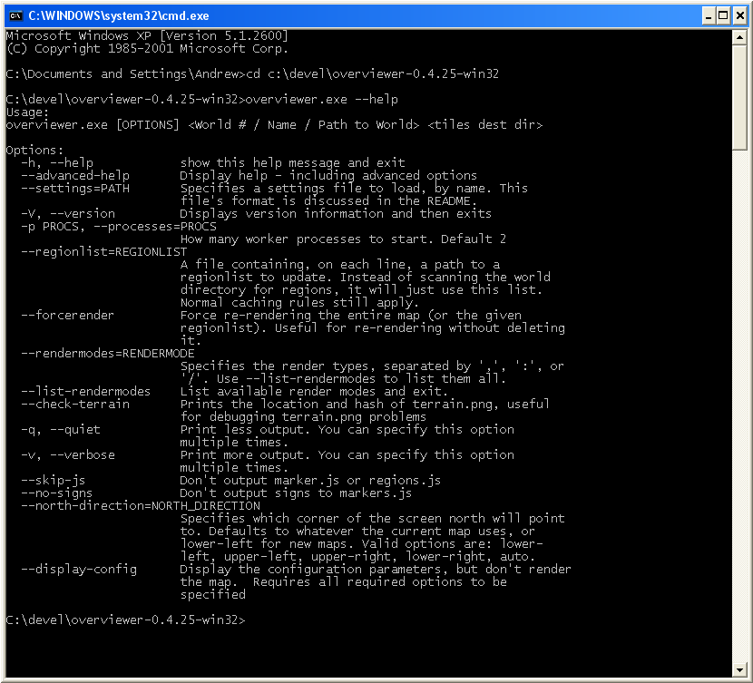

====================
Windows Newbie Guide
====================
If you're running Windows and aren't as familiar with the Windows command
prompt as the rest of the documentation assumes you are, this page is for you!

The Overviewer is a *command line* tool, which means you will need to use the command line to run it.

**First step:** Open the command line.
    Open your Start menu and type in the box 'cmd' and press enter. If you're
    running XP you'll go to the "run" option instead and then type 'cmd' and
    press enter. This should bring up the *command prompt*, a black window with
    a prompt where you can type *commands*.

Now that you know how to open a command line, and haven't been scared off yet,
the next step is to download the latest Overviewer.

**Step 2:** Download Overviewer
    Go to the `Downloads Page
    <https://github.com/overviewer/Minecraft-Overviewer/downloads>`_ and
    download the *latest* version for your architecture, either 32 bit or 64
    bit.

    *This is important. If you don't know which to choose, 32 or 64,* then you
    can find out by clicking on the start menu, *right clicking* on the
    "Computer" icon or "My Computer" icon (depending on your version of
    Windows, and then selecting "Properties." Somewhere among the information
    about your computer it should tell you if you're running a *32 bit
    architecture* or *64 bit architecture*. I forget exactly the wording, but
    look for a *32* or *64*.

    You'll want to download the latest version. We make small changes all the
    time, and a new version is uploadeded to that page for every change we
    make. It's usually best to just get the latest.

Okay, you've got a command prompt open. You've got The Overviewer downloaded.
We're half way there!

**Step 3:** Extract the Overviewer zip you downloaded.
    This is easy. I assume you know how to unzip things. Unzip the contents to
    somewhere you can find easily. You'll need to find it in the command
    prompt. It may help to leave the window with the unzipped contents open so
    you can remind yourself where it is.

    *Keep all those files together!* They're all needed to run The Overviewer
    (well except w9xpopen.exe. Unless you're running windows 95 lol!)

**Step 4:** Navigate in the command prompt to the location of overviewer.exe
    You remember that file you just extracted? Cool. We're going to *change
    directory* to that directory with the command prompt. Bring the command
    prompot window back up. The command we're going to use is called ``cd``, it
    stands for ... *change directory*!

    I'm going to illustrate this with an example. Let's say you extracted
    Overviewer to the directory
    ``c:\users\imauser\Downloads\overviewer-0.4.22-win64``. Here is exactly
    what you'll type into the command prompt and then press enter::

        cd c:\users\imauser\Downloads\overviewer-0.4.22-win64

    Okay, did it work? Your command *prompt* should now have the *current
    working directory* in it. If your prompt changed to the directory that you
    just cd'd to, then your current directory changed successfully! You're ready
    for the next step!

Okay before we actually run Overviewer for real, let's do a checkpoint. You
should have *cd*'d to the directory where overviewer.exe is. To test, type this
in and you should see the help text print out::

    overviewer.exe --help

note the two hyphens before "help". You should see something like this:

The help text displays the *usage* of overviewer.exe, or the parameters it takes
to run it.

::

    Usage:
    overviewer.exe [OPTIONS] <World # / Name / Path to World> <tiles dest dir>

Command line tool usage convention says that items in [square brackets] are
*optional*, while items in <angled brackets> are *required*.
